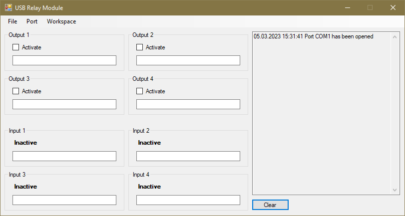

# Software for URM Board

[USB Relay Module (URM)](https://github.com/amgsus/URM) has in total 8 I/O: 4x dry-relay outputs and 4x optocoupled inputs. This software allows to control I/O state of the module.

Features:
- Control the state of I/O.
- Give a tag for I/O.
- Workspace can be saved and restored.

# Serial Protocol

The board uses a serial interface (based on UART or USB CDC) to communicate with the software (or any other type of a host). The communication protocol consists of "one byte" command from the host and "one byte" response from the device.

### Command byte to the device

The command byte has always bit 7 set (mask 0x80). A low nibble (bits 0-3) targets the state of dry-relay outputs 1-4: set bit turns ON a relay. Bits 4-6 are reserved and must be kept cleared.

### Response (status) byte from the device

The device responds with its state to a command. A low nibble (bits 0-3) indicates the states of dry-relay outputs (active high). A high nibble (bits 4-7) indicates the states of optocoupled inputs 1-4: bit set - the input is activated.

### Timeout

The software expects to receive the device status byte each second (by default). It has a timeout for 2.5 s, after which the software shows an error and closes the port.

# License

Anyone can use and/or modify this software as would like.
